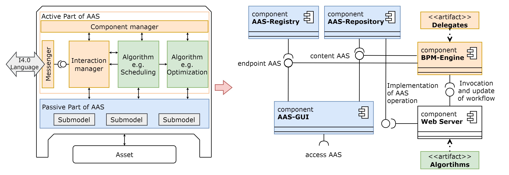

# VWS4LS Order Driven Production

The bidding process demonstrator was developed in the research project [Asset Administration Shell for the Wiring Harness](https://arena2036.de/en/asset-administration-shell-for-wire-harness) (VWS4LS). which was funded by the German Federal Ministry of Education and Research. A detailed description of the results of the various subprojects can be found [here](https://arena2036.de/de/vws4ls) (German only). 

The demonstrator shows an order driven production with the help of proactive Asset Administration Shells (AAS) and Business Pocess Model Notation (BPMN).

The architecture of the demonstrator is shown in [Fig. 1][fig_architecture]. On the left side you can see the abstract architeture[^footnoteAASArchitecture] of a proactive AAS with a passive and an active part. The right side shows the technical implementation. The exchange of I4.0-messages between several AAS is realized by an AAS submodel called Message Participant. In this submodel an operation with the name `newMessage` is implemented which follows the message structure of VDI 2193[^footnoteVDI2193-1],[^footnoteVDI2193-2]. To start the bidding process an additional user defined operation is specified in the Service Requester's AAS. Further details can be found in the published paper on the bidding process[^footnoteETFAPaper].

[fig_architecture]: ./images/environmentarchitecture.png "Architecture of proactive AAS"

Fig. 1: Architecture of proactive AAS

According to the architecture on the right in [Fig. 1][fig_architecture], the demonstrator consists of the following software components:

Blue coloured: [Basyx components](https://github.com/eclipse-basyx/basyx-java-server-sdk) `AAS-Registry, AAS-Repository` and the `AAS-GUI`.
Orange coloured: [Flowable-UI](https://www.flowable.com/open-source)
White coloured: [Node-Red server](https://github.com/node-red)
Green coloured: Single flows implemented in Node-Red server

To set up and run the demonstrator, two options exist.
* Option 1: Run the demonstrator with existing program code.
* Option 2: Expand the code of the demonstrator  

Option 2 can be implemented after the instructions of option 1 have been executed.

## Option 1: Run the demonstrator with existing programm code

### Set up environment

##### Docker
A [Docker Engine](https://docs.docker.com/engine/install/) should be installed on your computer.

Download the Flowable Docker image:

    docker pull ghcr.io/vws4ls/vws4ls-bidding-process/deploy-flowable:latest

##### Node-Red

The bidding process contains an algorithm to determine the feasible scope of the `Service Provider`. For this the capability matching algorithm is needed which uses own developed nodes in Node-Red. To set up the Node-Red environment follow the steps in the [capability matching repository](https://github.com/VWS4LS/vws4ls-capability-matching).

### Run the demonstrator

#### Download program code

Clone or download the zip file with the program code.

Switch to the folder `deploy` in your local folder.

Change the the variable `basyx.externalurl` in the file `application.properties`  to the IP adress of your computer. The port can be left as it is.

Start a command line in the `deploy` folder and type the following command:
    
    docker compose up -d
    
If all docker containers are started correctly you can reach the single software applications under the following adresses:

Basyx-UI: <http://localhost:3000/>
Node-Red: <http://localhost:1880/>
Flowable: <http://localhost:8081/flowable-ui/>

The default credentials for Flowable are as follows:
    
    Name: admin
    Password: test

>Hint: The credentials are used in the http-request invoked by the Node-Red server. If the credentials will be changed than this reuquest-nodes needs to be changed accordingly.

#### Initialize Flowable and Node-Red

When the containers are started for the first time, Node-Red and Flowable must be initialized. For this go to the directory `deploy/config` and do the following steps.

**Import Node-Red flows**
Import the four flows from the directory `deploy/config/node-red` into your Node-Red server.

**Import Flowable apps**
Go to the Apps tab in Flowable and import the two zip folders from the directory `deploy/config/flowable` into Flowable (see [Fig. 2][fig_importFlowableApps]). 

[fig_importFlowableApps]: ./images/ImportFlowableApps.png "Import of Flowable Apps"

Fig. 2: Import of Flowable Apps

Then publish the apps. Therfore, click on one app, for example the Service Requester, and click on `Publish`. Do the same for the Service Provider. After the import process, the associated `Processes` and `Forms` can be seen in the tabs of the same name (see [Fig. 3][fig_publishFlowableApps]). 

[fig_publishFlowableApps]: ./images/PublishFlowableApps.png "Publish of Flowable Apps"

Fig. 3: Publish of Flowable Apps

#### Start a bidding process 

To start a bidding process at least one `Service Requester` AAS and `Service Provider` AAS, which need to implement the Message Participant Submodel, must be stored in the `AAS-Repository`. For this example AAS are stored in the directoy `deploy/aasx`.

(tbd.) The following video shows how the software applications work together.

The demonstrator was developed for a special use case. If you want to change something you have to change the code of the Flowable delegates. To do so, you have to follow the instructions of option 2.

## Option 2: Expand the code of the demonstrator

Detailed information of implementing delegates in Flowable can be found [here](https://www.flowable.com/open-source/docs/oss-introduction).

## Build and start

### Build jar files

A dedicated development container is used for this, defined by the `docker-compose.yml` file in the main directory of the bidding process.

Start a command line in the main directory and type the following commands to build all necessary jar files:

    docker compose build
    docker compose run sdk
    cd /src/FlowableDelegates
    mvn package

This will generate jar files in the corresponding `target` folders, like `target/FlowableDelegates-1.0-SNAPSHOT.jar`.

### Build containers

Next, the docker images of the `deploy` folder need to be build.
These use the previously generated jar files, which need to be copied:

Type in the opend command line following commands:

    cd deploy
    ./build.sh

## Start demonstrator

Finally, the containers can be started:

    cd deploy
    docker compose up -d

Then make the same steps as described in the section [Start a bidding process](#startBiddingProcess)

[^footnoteAASArchitecture]: A. Belyaev und C. Diedrich, “Specification Demonstrator I4.0-Language v3.0,” Otto-von-Guericke-University Magdeburg, IFAT-LIA, Magdeburg, July 2019.
[^footnoteVDI2193-1]: VDI/VDE, “VDI/VDE 2193-1: Language for I4.0 components - Structure of messages,” April 2020
[^footnoteVDI2193-2]: VDI/VDE, “VDI/VDE 2193-2: Language for I4.0 components - Interaction protocol for tendering procedures,” January 2020
[^footnoteETFAPaper]: 
